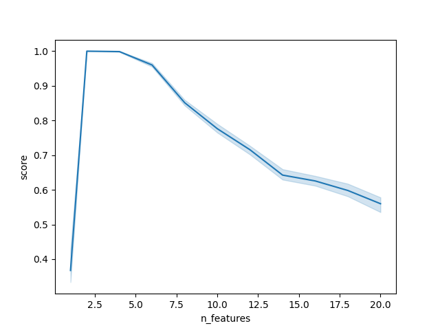

# fseval
Feature Selection evaluation framework 💎

## What
fseval is a framework for evaluating Feature Selection methods. It is built around a new set of metrics, using synthetic datasets for more meaningful evaluation.

## Usage
Install locally (not on PyPi yet) by cloning the repo. Execute with `fseval` folder in current working directory in a Python 3 environment:

```shell
python -m fseval.ranking.rfe ./example/descriptor.csv --batch_id=test
```

Will run RFE feature selection on the datasets described in `./example/descriptor.csv`. This will produce a ranking results file in `./results/test`.

The results can now be analyzed and validated. e.g. validate with classification accuracy with k-NN:

```shell
python -m fseval.validation.knn ./example/descriptor.csv --batch_id=test
```

Which can now be plotted using seaborn/pandas using:
```python
import os
import pandas as pd
import seaborn as sns

valdata = []
for _, dataset in pd.read_csv('./example/descriptor.csv').iterrows():
    path = os.path.join('./results/test/validation', dataset.path + '.csv')
    data = pd.read_csv(path)
    valdata.append(data)
valdata = pd.concat(valdata)

sns.lineplot(data=valdata, x='n_features', y='score')
```

Resulting in ✨:



Useful metrics can be computed as part of the evaluation pipeline. e.g. metrics for computing ROC curves:

```shell
python -m fseval.analysis.roc ./example/descriptor.csv --batch_id=test
```

```python
import os
import pandas as pd
import seaborn as sns
from fseval.analysis.lib.metrics import compute_interpolated_metrics

rocdata = []
for _, dataset in pd.read_csv('./example/descriptor.csv').iterrows():
    path = os.path.join('./results/test/roc', dataset.path + '.csv')
    data = pd.read_csv(path)
    rocdata.append(data)
rocdata = pd.concat(rocdata)

metricdata = rocdata\
    .groupby(['description', 'ranking_method', 'replica_no'])\
    .apply(compute_interpolated_metrics)\
    .reset_index()
sns.lineplot(data=metricdata, x='fpr', y='tpr')
```

... TODO: explain stability computation.

## SLURM
`fseval` works built-in with SLURM clusters. When `fseval` is submitted in a job array, datasets are automatically distributed over a preconfigured amount of jobs and cpus.

... TODO: explain scripts

## About
By Jeroen Overschie | University of Groningen

MSc Research Internship 2020.